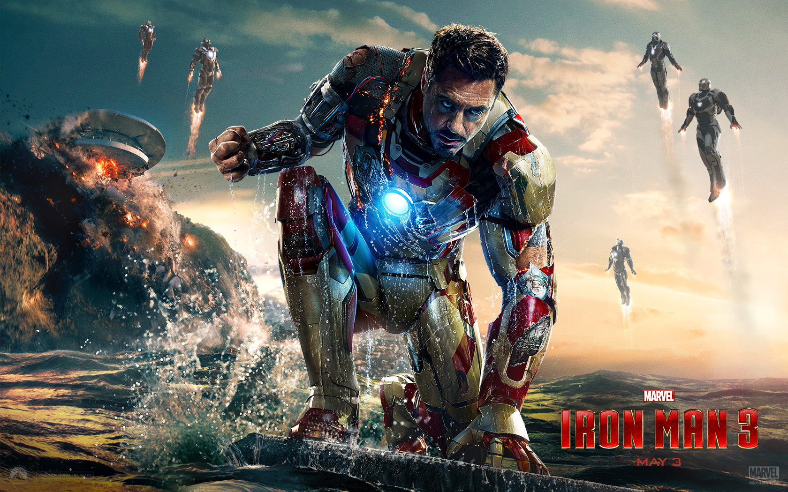

# IRONMAN - THE MARVEL CINEMATIC UNIVERSE

Iron Man is a fictional superhero appearing in American comic books published by Marvel Comics. The character was co-created by writer and editor Stan Lee, developed by scripter Larry Lieber, and designed by artists Don Heck and Jack Kirby. The character made his first appearance in Tales of Suspense #39 (cover dated March 1963), and received his own title in Iron Man #1 (May 1968).

## GETTING STARTED

This is basic HTML / CSS / JAVASCRIPT build. If you don't know How to accomplish this task then visit:
[Mozilla Developer Network](https://developer.mozilla.org/en-US/docs/Learn)

### PREREQUISITES

Just an editor and Git!

## AUTHORS

Team members:
1. Deepkumar Patel
2. Kapish Trivedi
3. Vyom Trivedi
4. Kunjan Trivedi

## LICENSE

This project is licensed under the MIT license.
